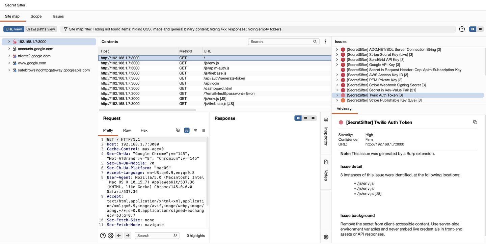
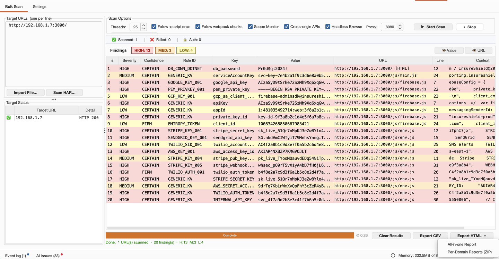
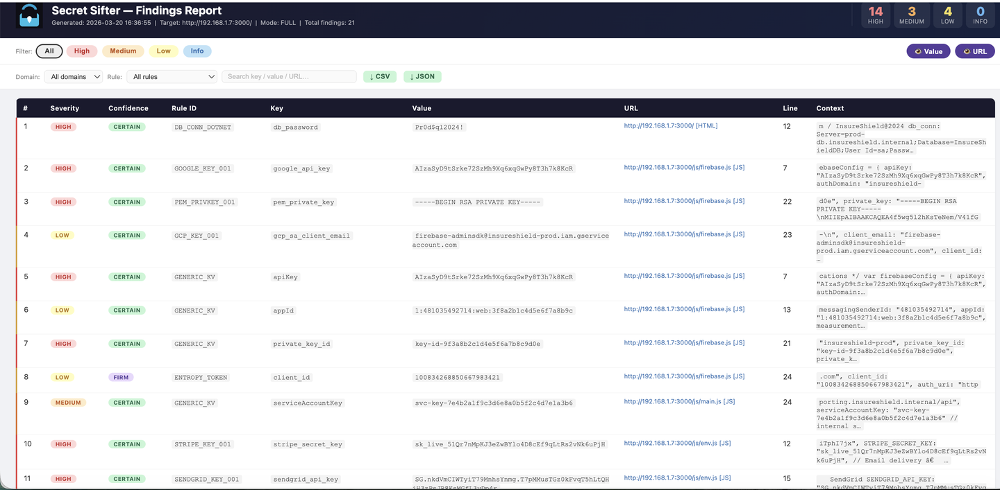
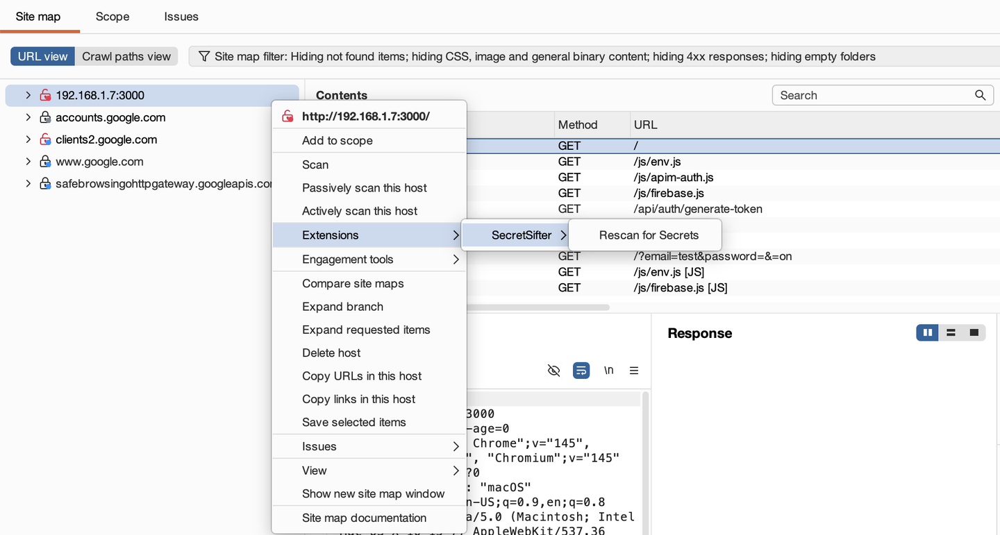
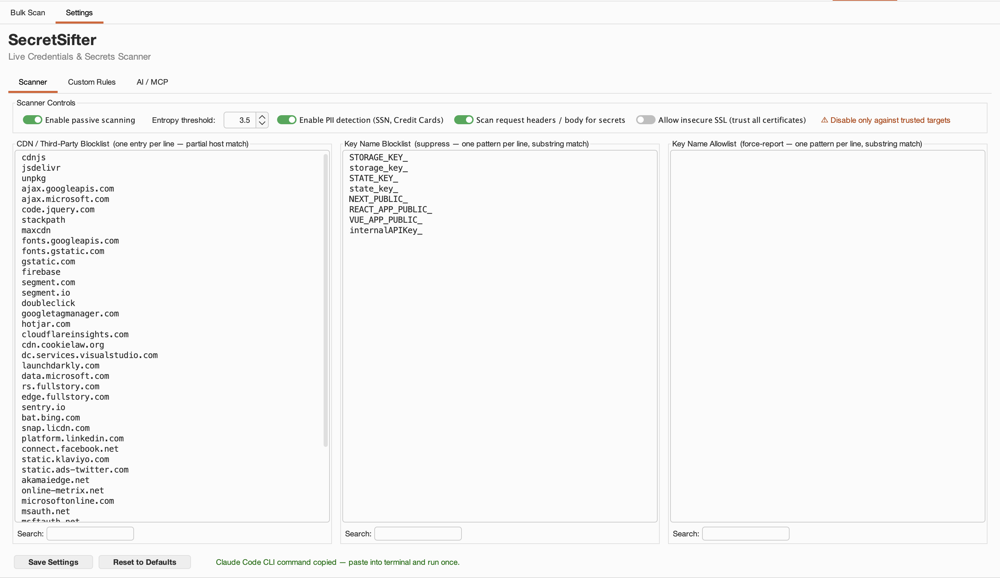
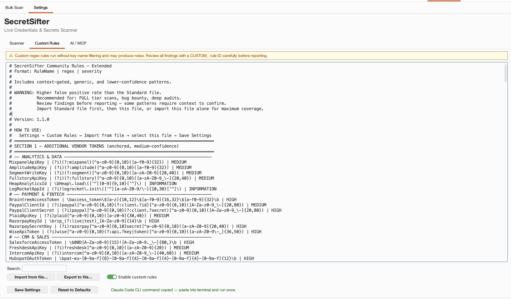
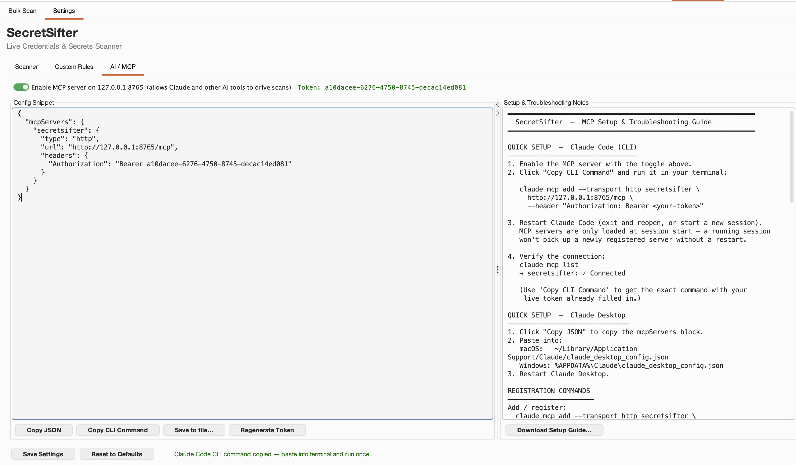

# SecretSifter Burp MCP — Burp Suite Extension

**Full edition** of SecretSifter for Burp Suite, with multi-provider AI Triage and a Model
Context Protocol (MCP) server for Claude Code integration on top of the same scanning core
as the BApp Store edition.

> **Looking for the BApp Store edition without AI/MCP?**
> See [secretsifter-burp](https://github.com/secretsifter/secretsifter-burp) — same scanner
> core, no AI providers, no listening socket. Available in Burp's BApp Store.
>
> **Why two editions?** PortSwigger's BApp Store policy disallows extensions that bind
> listening sockets. The MCP server in this edition binds `127.0.0.1:8765` (loopback only,
> still local-only) for Claude Code integration — which makes this edition incompatible with
> the BApp Store. Both editions ship the same scanner; this one adds AI Triage + MCP.

> **Community Edition note:** Passive scan check registration requires Burp Suite Professional.
> All other features (Bulk Scan, right-click rescan, sitemap sweep, proxy handler, AI Triage,
> MCP server) work in Community Edition. Findings appear in the Bulk Scan panel and via the
> context menu rather than in Dashboard → Issue Activity.

---

## Screenshots

| Dashboard — Issue Activity | Bulk Scan tab with live results |
|---|---|
|  |  |

| HTML Report | Right-click Rescan |
|---|---|
|  |  |

### Settings — Scanner Tab



### Settings — Custom Rules Tab



### Settings — AI / MCP Tab *(this edition only)*



---

## Features

| Feature | Detail |
|---|---|
| **Passive scanning** | Fires on every proxied response automatically; also sweeps existing sitemap on load |
| **100+ anchored token rules** | GitHub, GitLab, AWS, Stripe, OpenAI, Slack, Shopify, Azure, GCP, Docker Hub, Clerk, and more |
| **40+ context-gated rules** | Algolia, Cloudflare, Zendesk, Heroku, Datadog, Salesforce, Mistral, Cohere, Auth0, Supabase, and more |
| **Request header scanning** | Detects credentials in custom headers (e.g. `App_key`, `Resource`, `Ocp-Apim-Subscription-Key`) |
| **Generic KV & high-entropy scanner** | Catches unlisted keys using keyword + entropy heuristics |
| **PII detection** | SSN, credit card numbers (Luhn-validated), credential-bearing URLs |
| **Bulk Scan tab** | Paste/import URL lists; follows `<script src>`, webpack chunks; 1–50 concurrent threads |
| **HAR import** | Scan responses from a `.har` file directly — no live fetch needed (useful for auth-walled or offline targets) |
| **Headless Browse** | Optionally launch Chrome/Chromium headless through Burp proxy to capture dynamic XHR/Fetch calls |
| **Scope Monitor** | Capture passive proxy findings for watched hosts and route them into the Bulk Scan results table |
| **HTML reports** | Per-scan all-in-one HTML report (HTML + findings CSV + target-status CSV); per-domain ZIP (one file per hostname + same two CSVs) |
| **Scan tiers** | FAST / LIGHT / FULL — trade speed vs. coverage |
| **Key name blocklist / allowlist** | Suppress FP-prone key patterns or force-report specific key names regardless of entropy |
| **AI Triage (multi-provider)** | Right-click any finding or click *AI Triage All* — choose **Burp AI (Pro)**, **Anthropic API**, **OpenAI / Compatible**, or **Claude via MCP** in Settings. AI assesses real vs. noise; deterministic severity overrides applied post-confirmation; noise-flagged rows surface in a review dialog |
| **MCP Bridge** | JSON-RPC server on `127.0.0.1:8765` (loopback only) — Claude Code or any MCP-compatible AI agent can drive scans, fetch findings, and submit triage results |
| **Custom regex rules** | Import `Rule Name \| regex \| severity` lines via Settings. Optional **Custom rules only (raw)** toggle skips built-in scanners + FP filters |
| **NOISE marking** | Set Severity *or* Confidence to `NOISE` on any finding row to gray it out and exclude it from HTML / CSV / ZIP exports |
| **FP mitigations** | CDN blocklist, 60+ noise key filter, Angular/Vue directive filter, JWT suppression, UUID rejection |

---

## Network Communications

The extension does not make any outbound network connections by default. All findings are
detected locally by Burp's proxy and passive scan engine. Network activity occurs only when
the user explicitly triggers it.

| User action | Destination | Data sent |
|---|---|---|
| **Bulk Scan** tab → *Start* | The user's configured Burp proxy → user-pasted target URLs | The HTTP requests Burp would normally make for those URLs |
| **Bulk Scan** → *Headless Browse* enabled | Local Chrome/Chromium process launched as child process; traffic routed through the user's Burp proxy | Standard browser navigation to the user-pasted URLs |
| **Settings → AI Triage** = *Burp AI (Pro)* + click *AI Triage All* | Burp Pro's local AI provider via Montoya `api.ai()` (no external network from this extension) | Findings sent to Burp's own AI |
| **Settings → AI Triage** = *Anthropic API* + click *AI Triage All* | `api.anthropic.com` over HTTPS | Findings (rule name, key name, matched value, source URL, severity) — sent to the user's own Anthropic account using the user's API key |
| **Settings → AI Triage** = *OpenAI / Compatible* + click *AI Triage All* | User-configured endpoint URL (default: `api.openai.com`); supports self-hosted OpenAI-compatible endpoints (Ollama, LM Studio, etc.) | Same finding fields, sent to the user's OpenAI account or self-hosted endpoint |
| **Settings → AI Triage** = *Claude via MCP* + click *AI Triage All* | Local JSON-RPC server on `127.0.0.1:8765` (loopback only — not bound to any external interface). Claude Code or another local MCP client connects in. | Findings stored in extension memory for the MCP client to fetch via `secretsifter_get_triage_request` |

**Defaults:** Burp AI (Pro) is the default provider. All other providers require the user to
explicitly select the provider, paste their own API key, and (for OpenAI / compatible)
configure the endpoint URL. The MCP server is opt-in via Settings → MCP and listens only on
`127.0.0.1` (loopback), not on any external interface.

**API key handling:** All API keys are persisted via Burp's `Preferences` API (encrypted at
rest by Burp). Keys are never logged, written to disk in plaintext, or transmitted anywhere
other than the configured AI provider's endpoint.

**MCP authentication:** When the MCP server is enabled, a random per-session token is generated
and required as a `Authorization: Bearer <token>` header on every JSON-RPC request. The token
is stored in Burp's `Preferences`. Regenerating the token invalidates the previous one.

**No telemetry:** The extension does not phone home, send usage statistics, check for updates,
or perform any background network activity. The only outbound network calls are the ones
listed above, all of which are user-initiated.

---

## Requirements

| Component | Version |
|---|---|
| Burp Suite Professional | 2024.7+ (Montoya API) |
| Burp Suite Community | 2024.7+ (Bulk Scan, rescan, proxy handler, AI Triage, MCP all work; passive scan check skipped) |
| Java | 17+ (bundled with Burp) |
| OS | macOS (Intel / Apple Silicon), Windows (x64), or Linux |

---

## Installation

### 1. Download the JAR

Download `secretsifter-mcp-1.0.0.jar` from the [Releases page](https://github.com/secretsifter/secretsifter-burp-mcp/releases),
or build it yourself (see [Building from Source](#building-from-source)).

### 2. Load into Burp

1. Open Burp Suite → **Extensions** tab → **Installed** → **Add**
2. Set **Extension type**: Java
3. Browse to `secretsifter-mcp-1.0.0.jar`
4. Click **Next** — the extension loads and a **SecretSifter MCP** tab appears in the main tab bar

### 3. (Optional) Configure AI Triage

By default, AI Triage is **off**. To enable:

1. Go to **SecretSifter MCP → Settings → AI Triage**
2. Choose a provider:
   - **Burp AI (Pro)** — uses Burp's built-in AI; no API key needed (Pro license required)
   - **Anthropic API** — paste your Anthropic API key
   - **OpenAI / Compatible** — paste your key + endpoint URL (default `https://api.openai.com/v1/chat/completions`)
3. Click **Save Settings**

### 4. (Optional) Configure MCP for Claude Code

1. Go to **SecretSifter MCP → Settings → AI / MCP**
2. Toggle **Enable MCP server on 127.0.0.1:8765** → ON, then **Save Settings**
3. Click **Copy CLI Command** (or **Copy JSON** for Claude Desktop)
4. Paste the command into your terminal — registers the SecretSifter MCP server with Claude Code
5. Restart Claude Code (MCP servers load at session start)
6. Verify: `claude mcp list` should show `secretsifter: ✓ Connected`

You can now ask Claude things like:
- "Scan https://app.example.com for exposed secrets"
- "Bulk scan these 20 URLs and give me a summary: [...]"
- "Triage all findings and tell me which are real"

---

## Usage

### Passive Scanning (automatic)

Once loaded, the extension scans every response passing through the Burp proxy. Findings appear in:
- **Dashboard → Issue Activity** (as Burp AuditIssues — Pro only)
- The **SecretSifter MCP → Bulk Scan** results table (all editions)

On load, the extension also sweeps all responses already recorded in **Target → Site map** so that
findings appear immediately — even for traffic captured before the extension was installed.

### Right-click Rescan

In **Proxy → HTTP History** or **Repeater**, right-click any request → **Rescan for Secrets**.
Expands to all site-map entries for the selected host(s). Optionally save an HTML report after the scan.

### Bulk Scan Tab

1. Navigate to **SecretSifter MCP → Bulk Scan**
2. Paste one URL per line into the URL box (or import a `.txt` / `.csv` file, or import a `.har` file)
3. Choose scan tier and thread count
4. Click **▶ Start Scan**
5. Results populate the table in real time
6. Export as **CSV**, **HTML Report**, or **HTML Report (per domain)**
7. (Optional) Click **AI Triage All** to send all findings to the configured AI provider

**Bulk Scan options:**

| Option | Description |
|---|---|
| Tier | FAST (anchored tokens only) / LIGHT (+ entropy) / FULL (+ PII, KV, SSR blobs) |
| Threads | 1–50 concurrent URL workers (default 25) |
| Follow script-src | Fetch and scan `<script src>` URLs found in HTML responses |
| Follow webpack chunks | Follow chunk references inside JS bundles (depth 1) |
| Scope Monitor | Capture passive-scan findings from Burp proxy traffic for watched hosts |
| Cross-origin APIs | Capture XHR/Fetch calls fired from a watched host to other domains |
| Headless Browse | Launch Chrome/Chromium headless through Burp proxy to capture dynamic JS API calls |
| Scan Site Map | Scan all JS/HTML responses already captured in Burp's site map |

### Settings Tab

| Sub-tab | Description |
|---|---|
| **Scanner** | Tier, entropy threshold, PII toggle, request header scan, allow insecure SSL, CDN/key blocklists/allowlist |
| **Custom Rules** | Import/export user-defined `Rule Name \| regex \| severity` lines + Custom rules only (raw) toggle |
| **AI Triage** | Choose provider (Burp AI, Anthropic, OpenAI / Compatible, Claude via MCP) and provide API key + endpoint |
| **AI / MCP** | Enable MCP server, view auth token, copy Claude Code CLI command, copy Claude Desktop JSON config |

---

## Scan Tiers

| Tier | Rules Active | Use When |
|---|---|---|
| **FAST** | 100+ anchored vendor tokens | Quick recon, large site maps |
| **LIGHT** | + High-entropy scanner + 40+ context-gated rules + DB strings | Standard pentest |
| **FULL** | + PII (SSN, CC) + Generic KV + SSR state blobs + JSON walker + getter functions | Deep audit, bug bounty |

---

## Building from Source

### Prerequisites

- Java 17+
- Gradle 8+ (or use the bundled `./gradlew` wrapper)

### Build

```bash
git clone https://github.com/secretsifter/secretsifter-burp-mcp
cd secretsifter-burp-mcp
./gradlew shadowJar
```

Output: `build/libs/secretsifter-mcp-1.0.0.jar` (~580 KB)

The build is **reproducible**: anyone cloning this repo and running the same command produces
a byte-identical JAR (`preserveFileTimestamps = false`, `reproducibleFileOrder = true`).

### Run tests

```bash
./gradlew test
```

Test report: `build/reports/tests/test/index.html`

### Verify the JAR matches the published artifact

```bash
shasum -a 256 build/libs/secretsifter-mcp-1.0.0.jar
```

Expected SHA-256 will be published in the [v1.0.0 Release notes](https://github.com/secretsifter/secretsifter-burp-mcp/releases/tag/v1.0.0).

---

## Severity Levels

| Level | Meaning |
|---|---|
| **CRITICAL** | Live credentials with broad scope (e.g. AWS key+secret, Stripe live key, Azure client secret) |
| **HIGH** | Active credentials or tokens with significant access |
| **MEDIUM** | Tokens confirming a live integration but with limited standalone impact |
| **LOW** | Identifiers or keys with limited standalone risk |
| **INFORMATION** | GUIDs, public identifiers, or structural findings unlikely to be exploitable |

AI Triage can automatically reassess severity for each finding — adjusting based on vendor,
context, and source URL. Deterministic overrides apply to vendor-specific key names
(e.g. `AppKey*` → CRITICAL, `SubscriptionKey*` → HIGH).

---

## False Positive Reduction

The extension includes built-in noise filtering, entropy thresholds, CDN domain skipping, and
structural validation (Luhn, SSN format checks) to keep results actionable. User-configurable
key name blocklist and allowlist are available in the Settings tab.

For deeper detail, see [TECHNICAL_OVERVIEW.md](TECHNICAL_OVERVIEW.md) and the
[Engineering Reference](docs/SecretSifter_Engineering_Reference.html).

---

## Community Rule Packs

Drop these into Settings → Custom Rules → Import for additional coverage:

- [Standard pack](community-rules/community-rules-standard.txt) — 200+ vendor patterns curated for low FP rate
- [Extended pack](community-rules/community-rules-extended.txt) — medium-confidence patterns; higher FP rate, recommended for FULL-tier scans + bug bounty

---

## Documentation

| Doc | What it covers |
|---|---|
| [TECHNICAL_OVERVIEW.md](TECHNICAL_OVERVIEW.md) | High-level architecture: tech stack, scan pipeline, detection layers, severity model |
| [docs/SecretSifter_Documentation.html](docs/SecretSifter_Documentation.html) ([PDF](docs/SecretSifter_Documentation.pdf)) | Comprehensive user manual: install, usage, settings, reports |
| [docs/SecretSifter_Engineering_Reference.html](docs/SecretSifter_Engineering_Reference.html) ([PDF](docs/SecretSifter_Engineering_Reference.pdf)) | Engineering deep-dive: build system, scan phases, all rules, FP guards, MCP bridge |

---

## Troubleshooting

### Extension does not load
- Verify Burp Suite version is 2024.7 or later
- Check the **Extensions → Output** tab for error messages
- Confirm you are loading the **shadow JAR** (`secretsifter-mcp-1.0.0.jar`), not the plain compile output

### No findings appear for a known secret
- Check **Settings → Scan Tier** — switch to FULL for maximum coverage
- Verify the response is flowing through Burp's proxy (not directly)
- For JS-heavy SPAs: use **Bulk Scan** with **Follow script-src** and **Follow webpack chunks** enabled,
  or browse the target through Burp Browser first then use **Scan Site Map**
- For secrets in request headers (e.g. `App_key`): confirm **Scan request headers** is enabled in Settings

### Burp slows down during passive scan
- Switch Scan Tier to **FAST** in Settings
- Expand the CDN blocklist to skip high-volume analytics traffic
- Disable PII scanning if not needed (Settings → PII Detection → Off)

### Headless Browse does nothing / Chrome not found
- Ensure Google Chrome or Chromium is installed and on `PATH`
- On macOS: `/Applications/Google Chrome.app` is detected automatically
- Check the **Extensions → Output** tab for `[Headless] Chrome/Chromium not found` messages
- The feature routes all traffic through Burp proxy — ensure Burp is listening on the configured port

> **Security note:** Headless Browse is opt-in and requires explicit user consent on first use.
> All traffic is routed exclusively through Burp's local proxy — no data leaves your machine.
> Each scan uses an isolated Chrome profile (`--user-data-dir` in system temp) that is discarded after the scan.

### AI Triage All button does nothing
- For **Burp AI** provider: requires Burp Suite Professional with AI features enabled (Settings → AI; ensure *Disable AI features* is **unchecked**). Reload the extension after enabling AI.
- For **Anthropic** / **OpenAI**: confirm API key is set in Settings → AI Triage and click **Save Settings**.
- For **Claude via MCP**: confirm the MCP server toggle is ON, the token is registered with Claude Code, and Claude is running.

### Claude Code reports "Failed to connect" to MCP server
- Confirm the MCP server toggle is enabled in **Settings → AI / MCP**
- Verify Burp is running (the server stops when Burp exits)
- Re-run `claude mcp add ...` (use the **Copy CLI Command** button to get the current token)
- Test manually: `curl -s -X POST http://127.0.0.1:8765/mcp -H "Authorization: Bearer <token>" -H "Content-Type: application/json" -d '{"jsonrpc":"2.0","id":1,"method":"initialize","params":{"protocolVersion":"2024-11-05","capabilities":{},"clientInfo":{"name":"test","version":"1.0"}}}'`
- If you get **401**: token mismatch — regenerate via the **Regenerate Token** button and re-register
- If **connection refused**: server is not running — toggle the enable switch

### Findings in Bulk Scan table but not in Dashboard
- Dashboard → Issue Activity requires Burp Suite **Professional**
- In Community Edition, all findings are available in the Bulk Scan table and HTML/CSV export

---

## Credits

Vendor token format specifications are publicly documented by their respective service providers.
See [NOTICE](NOTICE) for details.

---

## License

MIT License — free to use, modify, and distribute. See [LICENSE](LICENSE) for full terms.
